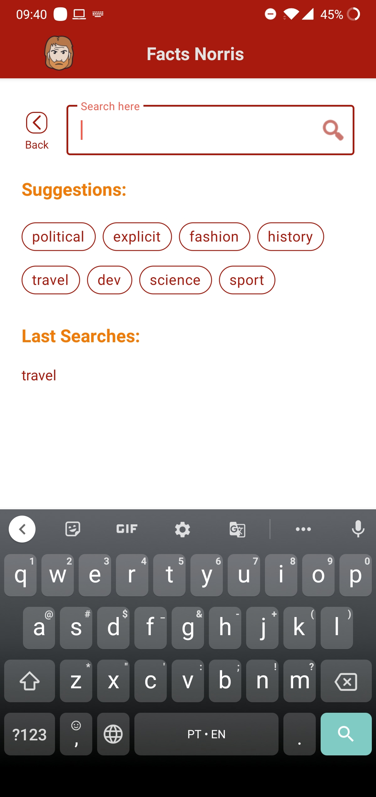

<h1 align="start">Facts Norris</h1>


[](https://github.com/ViniGouveia/facts-norris-app/actions/workflows/pr-ci-config.yml)
[](https://codecov.io/gh/ViniGouveia/facts-norris-app)

<h1 align="start">Sobre</h1>

O objetivo da aplicação é listar fatos sobre Chuck Norris, com opção de filtrar a lista através da feature de busca, podendo também compartilhar o fato, clicando nele. Exemplos abaixo.

O projeto foi um pouco desafiador, pois nunca tinha trabalhado com a arquitetura MVVM, kotlin coroutines e outras ferramentas utilizadas, mas acredito que tenha tomado as melhores decisões. Não tenho muito conhecimento sobre testes instrumentados, por isso consegui implementar apenas alguns exemplos mas esse é um desafio que decidi abraçar para os próximos projetos. Não tenho muita habilidade com UI/UX, mas tentei deixar o mais agradável possível.

<h1 align="start">Como executar</h1>
<p align="start">A execução do projeto é simples:</p>

```
- Clone este repositório; 
  $ git clone https://github.com/ViniGouveia/facts-norris-app.git

- Abra o projeto no Android Studio;

- Aguarde a indexação dos arquivos (esse processo pode demorar alguns minutos, pela quantidade de dependências no projeto);

- Por fim, execute o projeto em um dispositivo físico ou virtual.
```

<h1 align="start">Explicação da arquitetura</h1>

Na arquitetura do projeto, decidi focar no funcionamento e na manutenção do aplicativo, seguindo ao máximo os princípios SOLID e da Clean Architecture.

<p align="middle">
    
    <p style="text-align:center"><i>Essa é uma representação da arquitetura utilizada no projeto. Entre a classe Repository e a ViewModel existe a camada (não obrigatória) UseCase, responsável pelas regras de negócio e que faz comunicação com o Repository ou com outros UseCases.</i></p>
    <p style="text-align:center"><i>As flechas podem ser traduzidas como "fala com".</i></p>
</p>

<h1 align="start">Features</h1>

<p align="middle">
    
    <p style="text-align:center">Essa é uma representação da primeira tela que o usuário irá ver ao entrar na aplicação.</p>
</p>

<p align="middle">
    
    <p style="text-align:center">Após realizar alguma busca, os fatos serão carregados e exibidos como no exemplo acima.</p>
</p>

<p align="middle">
    
    <p style="text-align:center">Essa é a tela onde são feitas as buscas no app. São apresentadas 8 sugestões aleatórias cada vez que a tela é exibida e também são exibidas as últimas buscas feitas pelo usuário. É possível voltar a tela anterior clicando no botão "back".</p>
</p>

<h1 align="start">Continuous Integration</h1>

O projeto utiliza Github Actions, que tem como funcionalidade, executar os scripts de CI quando um Pull Request ou quando uma Tag é criada.

<h3 align="start">Pull Request CI</h3>

O script roda em duas etapas:

   - Análise estática do código: O script utiliza o plugin detekt para fazer uma análise do código, verificando se tudo está formatado consistentemente e se não possui erro na complexidade;
    
   - Cobertura de código: o JUnit5 é responsável por executar os testes unitários e instrumentados. O reporte é feito pelo Jacoco e o Codecov.io, que checa a cobertura do código, gerando um diagnóstico de cobertura.

<h3 align="start">Tag CI</h3>

O script possui apenas uma etapa, que consiste em gerar um debug APK e dar upload nele como um artefato do Github Actions.

<h1 align="start">Algumas bibliotecas utilizadas</h1>

   - Koin (injeção de dependência);
   
   - Retrofit (cliente de comunicação com web service);
   
   - Navigation (ferramenta para navegação entre as telas);
   
   - Room (banco de dados local);
   
   - Kotlin Coroutines (códigos assíncronos).
